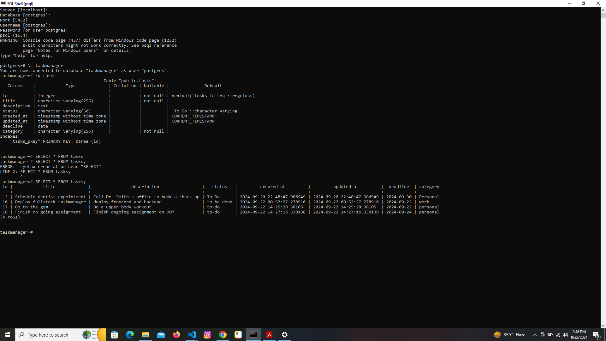
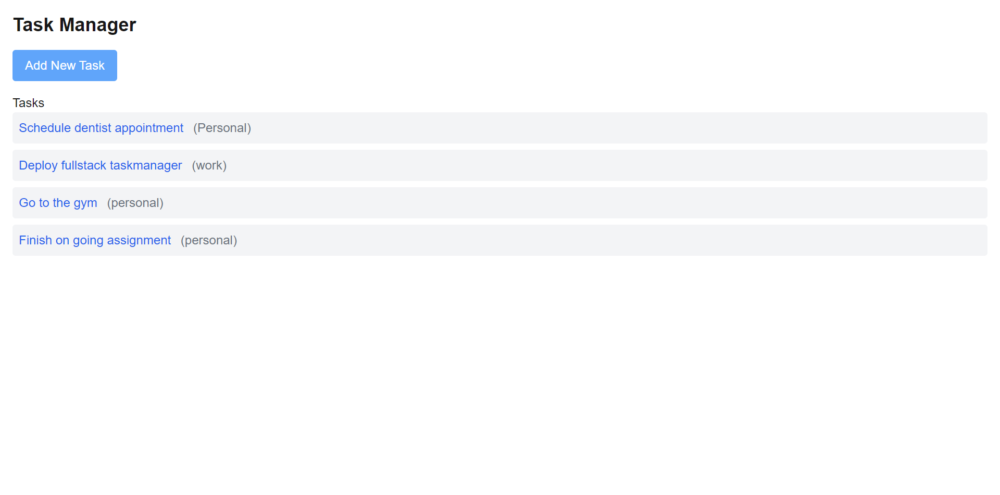
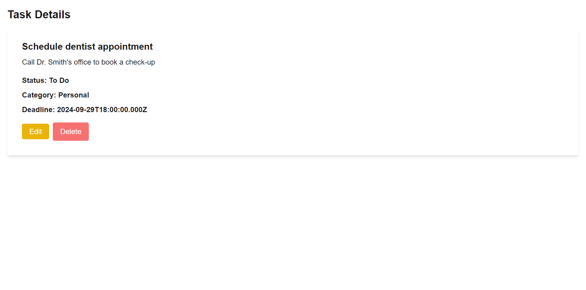
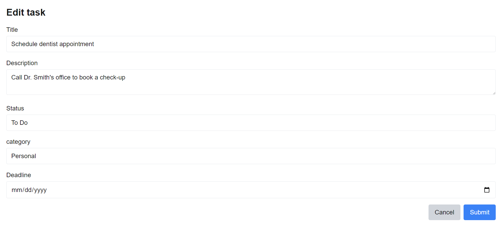

# Project Milestones completed:

- PostgreSQL Schema :
  

- RESTful API (Next.js + Node.js Backend)
- Create a task

- Retrieve all tasks

- Retrieve a specific task by ID

- Update a task

- Delete a task

- A page displaying all tasks.
  
- A detail page for individual tasks.
  
- Forms for creating and updating tasks.
  
  
- Task categorization and completion features.
  

# Issues on deploy

- Deployment to free tier Render was not successful as Render requires payment info incase of using their postgres database service and fullstack hosting service
