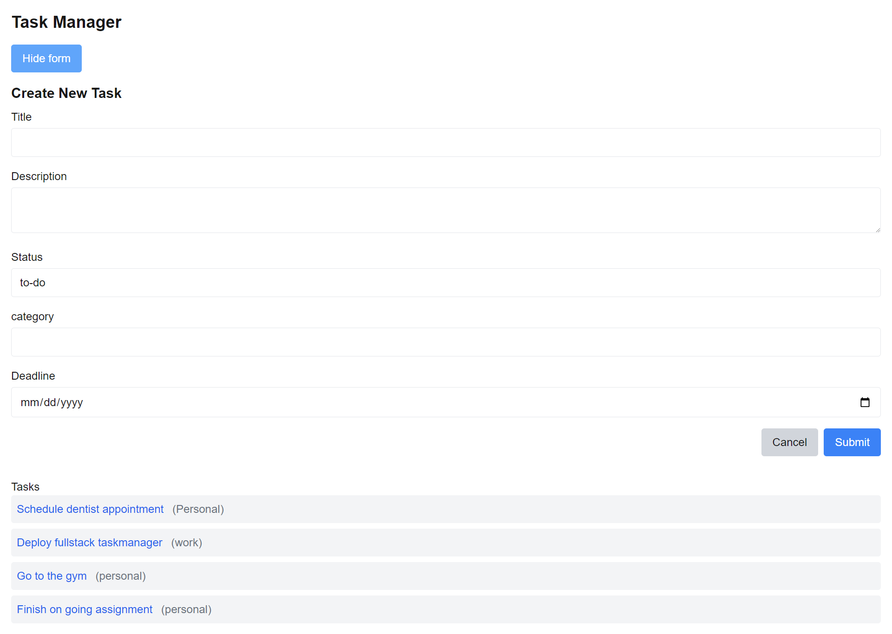

# Project Milestones completed:

- PostgreSQL Schema :
  Table "public.tasks"
  Column | Type | Collation | Nullable | Default
  -------------+-----------------------------+-----------+----------+-----------------------------------
  id | integer | | not null | nextval ('tasks_id_seq'::regclass)
  title | character varying(255) | | not null |
  description | text | | |
  status | character varying(50) | | | 'To Do'::character varying
  created_at | timestamp without time zone | | | CURRENT_TIMESTAMP
  updated_at | timestamp without time zone | | | CURRENT_TIMESTAMP
  deadline | date | | |
  category | character varying(255) | | not null |

- RESTful API (Next.js + Node.js Backend)
- Create a task
  
- Retrieve all tasks
- Retrieve a specific task by ID
- Update a task
- Delete a task
- A page displaying all tasks.
- A detail page for individual tasks.
- Forms for creating and updating tasks.
- Task categorization and completion features.

# Issues on deploy

- Deployment to free tier Render was not successful as Render requires payment info incase of using their postgres database service and fullstack hosting service

-
